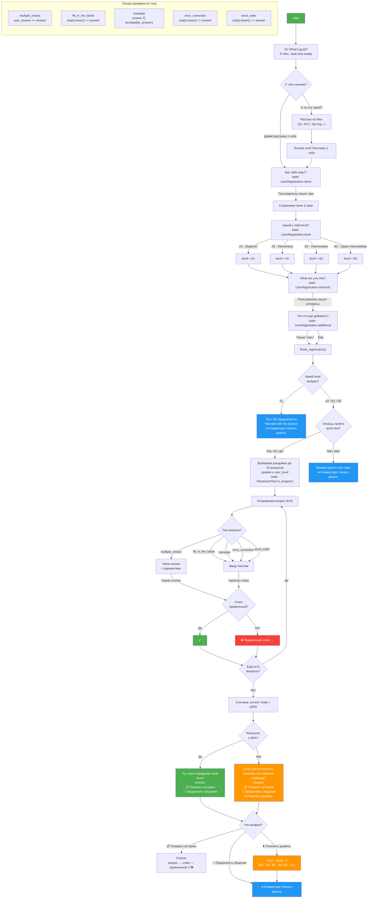

# Блок-схема бота Alex

```mermaid
flowchart TD
    START["/start"] --> GREETING["Yo! What's good?<br>Я Alex, твой new buddy"]
    GREETING --> CHOICE{"С чего начнём?"}

    CHOICE -->|"А ты кто такой?"| ABOUT_ALEX["Рассказ об Alex<br>(22, NYC, hip-hop...)"]
    CHOICE -->|"Давай расскажу о себе"| ASK_NAME

    ABOUT_ALEX --> ABOUT_ALEX_BTN["Sounds cool! Расскажу о себе"]
    ABOUT_ALEX_BTN --> ASK_NAME

    %% ===== РЕГИСТРАЦИЯ =====
    ASK_NAME["Как тебя зовут?<br><i>state: UserRegistration.name</i>"]
    ASK_NAME -->|"Пользователь пишет имя"| SAVE_NAME["Сохраняем name в state"]

    SAVE_NAME --> ASK_LEVEL["Какой у тебя level?<br><i>state: UserRegistration.level</i>"]
    ASK_LEVEL -->|"A1 - Beginner"| SAVE_A1["level = A1"]
    ASK_LEVEL -->|"A2 - Elementary"| SAVE_A2["level = A2"]
    ASK_LEVEL -->|"B1 - Intermediate"| SAVE_B1["level = B1"]
    ASK_LEVEL -->|"B2 - Upper-Intermediate"| SAVE_B2["level = B2"]

    SAVE_A1 --> ASK_INTERESTS
    SAVE_A2 --> ASK_INTERESTS
    SAVE_B1 --> ASK_INTERESTS
    SAVE_B2 --> ASK_INTERESTS

    ASK_INTERESTS["What are you into?<br><i>state: UserRegistration.interests</i>"]
    ASK_INTERESTS -->|"Пользователь пишет интересы"| ASK_ADDITIONAL

    ASK_ADDITIONAL["Что-то ещё добавить?<br><i>state: UserRegistration.additional</i>"]
    ASK_ADDITIONAL -->|"Пишет текст"| FINISH_REG
    ASK_ADDITIONAL -->|"Skip"| FINISH_REG

    %% ===== РАЗВИЛКА ПОСЛЕ РЕГИСТРАЦИИ =====
    FINISH_REG["finish_registration()"]
    FINISH_REG --> LEVEL_CHECK{"Какой level<br>выбрал?"}

    LEVEL_CHECK -->|"A1"| NO_TEST["Тест НЕ предлагается<br>'Начнём with the basics!'<br>➜ Клавиатура: Начать диалог"]
    LEVEL_CHECK -->|"A2 / B1 / B2"| OFFER_TEST{"Хочешь пройти<br>quick test?"}

    OFFER_TEST -->|"Yep, let's go!"| START_TEST
    OFFER_TEST -->|"Nah, later"| SKIP_TEST["'Можем пройти тест later'<br>➜ Клавиатура: Начать диалог"]

    %% ===== ТЕСТИРОВАНИЕ =====
    START_TEST["Выбираем рандомно до 10 вопросов<br>уровня ≤ user_level<br><i>state: PlacementTest.in_progress</i>"]
    START_TEST --> SEND_Q

    SEND_Q["Отправляем вопрос N/10"]
    SEND_Q --> Q_TYPE{"Тип вопроса?"}

    Q_TYPE -->|"multiple_choice"| MC["Inline-кнопки<br>с вариантами"]
    Q_TYPE -->|"fill_in_the_blank"| TEXT_INPUT["Ввод текстом"]
    Q_TYPE -->|"translate"| TEXT_INPUT
    Q_TYPE -->|"error_correction"| TEXT_INPUT
    Q_TYPE -->|"word_order"| TEXT_INPUT

    MC -->|"Нажал кнопку"| CHECK_ANS
    TEXT_INPUT -->|"Написал ответ"| CHECK_ANS

    CHECK_ANS{"Ответ<br>правильный?"}
    CHECK_ANS -->|"Да"| FEEDBACK_OK["✅"]
    CHECK_ANS -->|"Нет"| FEEDBACK_ERR["❌ Правильный ответ: ..."]

    FEEDBACK_OK --> MORE_Q{"Ещё есть<br>вопросы?"}
    FEEDBACK_ERR --> MORE_Q

    MORE_Q -->|"Да"| SEND_Q
    MORE_Q -->|"Нет"| CALC_RESULT

    %% ===== РЕЗУЛЬТАТЫ =====
    CALC_RESULT["Считаем: correct / total × 100%"]
    CALC_RESULT --> PASSED{"Результат<br>≥ 60%?"}

    PASSED -->|"Да"| RESULT_GOOD["'Ты точно определил свой level!'<br>Кнопки:<br>📋 Показать историю<br>💬 Продолжить общение"]
    PASSED -->|"Нет"| RESULT_BAD["'Level даётся нелегко...<br>понизить или принять challenge!'<br>Кнопки:<br>📋 Показать историю<br>💬 Продолжить общение<br>⬇️ Понизить уровень"]

    %% ===== ДЕЙСТВИЯ ПОСЛЕ ТЕСТА =====
    RESULT_GOOD --> POST_ACTION
    RESULT_BAD --> POST_ACTION

    POST_ACTION{"Что выбрал?"}
    POST_ACTION -->|"📋 Показать историю"| SHOW_HISTORY["Список:<br>вопрос → ответ — правильный ✅/❌"]
    POST_ACTION -->|"💬 Продолжить общение"| TO_CHAT["➜ Клавиатура: Начать диалог"]
    POST_ACTION -->|"⬇️ Понизить уровень"| DOWNGRADE

    DOWNGRADE["level = level - 1<br>(B2→B1, B1→A2, A2→A1)"]
    DOWNGRADE --> TO_CHAT

    %% ===== ПРОВЕРКА ОТВЕТОВ (детали) =====
    subgraph ANSWER_CHECK ["Логика проверки по типу"]
        direction TB
        CHK_MC["multiple_choice<br>user_answer == answer"]
        CHK_FILL["fill_in_the_blank<br>strip().lower() == answer"]
        CHK_TRANS["translate<br>answer ∈ acceptable_answers"]
        CHK_ERR["error_correction<br>strip().lower() == answer"]
        CHK_WORD["word_order<br>strip().lower() == answer"]
    end

    %% Стили
    style START fill:#4CAF50,color:#fff
    style NO_TEST fill:#2196F3,color:#fff
    style SKIP_TEST fill:#2196F3,color:#fff
    style TO_CHAT fill:#2196F3,color:#fff
    style RESULT_GOOD fill:#4CAF50,color:#fff
    style RESULT_BAD fill:#FF9800,color:#fff
    style FEEDBACK_OK fill:#4CAF50,color:#fff
    style FEEDBACK_ERR fill:#f44336,color:#fff
    style DOWNGRADE fill:#FF9800,color:#fff
```
